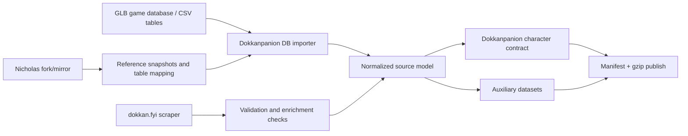

# Dokkan Data Source Repo Evaluation

## Purpose

This document records findings from a 2026-06-27 review of community repos that may help replace or reduce the `dokkan.fyi` scraping work:

- `pawelorzech/dokkan-battle-bot`: <https://github.com/pawelorzech/dokkan-battle-bot>
- `Nicholas1006/dokkan-backend`: <https://github.com/Nicholas1006/dokkan-backend>
- `bensnilloc/Dragonball-Z-Dokkan-Battle-Database-Decryptor`: <https://github.com/bensnilloc/Dragonball-Z-Dokkan-Battle-Database-Decryptor>
- `tanukijs/dokkan-bot`: <https://github.com/tanukijs/dokkan-bot>
- `jazzrz86/Open-Source-Battle-Bot`: <https://github.com/jazzrz86/Open-Source-Battle-Bot>

The goal is to decide whether Dokkanpanion should keep building a scraper from scratch, fork an existing backend, or build a first-party data pipeline from the Global game database.

Related follow-up docs for adjacent research:

- `docs/game-db/kx-wiki-unidokkan-findings.md`
- `docs/game-db/udfiles-findings.md`

## Executive recommendation

Do not choose between "scrape everything ourselves" and "depend on somebody else's repo" as a hard binary.

Recommended path:

1. Fork or mirror `Nicholas1006/dokkan-backend` immediately as a preservation/reference source.
2. Do not depend on Nicholas' repo, workflows, binary downloader, or generated JSON contract directly in Dokkanpanion.
3. Build our own first-party importer/publisher around the Global game database/CSV tables.
4. Keep the `dokkan.fyi` scraper as a validator, enrichment source, and fallback until the database pipeline proves coverage.

Why:

- The game database route is much richer and more canonical than web scraping.
- Nicholas' repo already proves the GLB DB can drive most of the mechanics we care about.
- But the repo has no explicit license, depends on a non-open-source `.exe`, and mixes data extraction with personal frontend/S3 deployment.
- A fork protects us from deletion, but a clean pipeline protects us from coupling.

In short: preserve the repo, learn from it, and replace its operational core with our own maintainable pipeline.

## Current local context

The existing docs already describe a serious `dokkan.fyi` plan:

- `docs/dokkan-fyi-migration-plan.md`
- `docs/specs/dokkan-fyi-character-contract.md`
- `docs/specs/dokkan-fyi-auxiliary-datasets-plan.md`
- `docs/dataset-hosting-plan.md`

That work is still valuable even if the primary data source changes. The most reusable pieces are:

- app-facing character contract design
- structured standby/finish/transformation modeling
- auxiliary dataset boundaries
- R2 publishing shape
- validation checklist and golden-card mindset

The main thing that changes is the source adapter. Instead of scraping `dokkan.fyi` page payloads as the primary source, we can generate the same or better contracts from GLB database tables.

## Repo 1: `pawelorzech/dokkan-battle-bot`

### Snapshot

- GitHub status: public archive
- GitHub page states it was archived on 2024-10-12
- Default branch: `master`
- Latest shallow-clone commit reviewed: `16cacd3571e4afd2af6f13cf5ae1da5ca6e193d1`
- Latest commit date in clone: 2019-11-20
- License: LGPL-3.0
- GitHub page showed 30 commits, 11 stars, 18 forks at review time

### What it is

This is an old Dokkan gameplay bot. Its README says:

- `packet.py` handles packet encryption and authorization
- `commands.py` contains most gameplay command logic
- `decryptor.py` uses `pysqlsimplecipher`

The code confirms that shape:

- `packet.py` builds MAC auth headers for `ishin-global.aktsk.com` and `ishin-production.aktsk.jp`
- `packet.py` encrypts/decrypts `sign` payloads with AES-CBC and an OpenSSL-style key/IV derivation
- `commands.py` calls live game endpoints such as:
  - `/user`
  - `/quests/{id}/supporters`
  - `/quests/{id}/sugoroku_maps/start`
  - `/quests/{id}/sugoroku_maps/finish`
  - `/support_leaders`
- `config.py` maps SQLite tables through Orator models like `cards`, `quests`, `leader_skills`, `link_skills`, `passive_skill_sets`, `z_battle_stage_views`, and item tables

### What it is useful for

Use it as protocol archaeology:

- confirms historical endpoint hostnames and route shapes
- shows the old MAC auth construction
- shows how `sign` payloads were encrypted/decrypted
- confirms many game DB table names used by older tooling
- gives hints about GLB/JP fallback behavior

It is especially useful for understanding how community tools historically accessed the game client and local SQLite DB.

That is also consistent with older community reports that Dokkan startup traffic could be inspected through HTTPS MITM/proxy setups and that access was MAC-authenticated.

Important nuance:

- this repo is evidence that some historical Dokkan request/sign flows used AES-CBC-style payload handling
- it is not, by itself, proof that every modern API packet is still application-encrypted in the same way after HTTPS interception

### What it is not useful for

Do not base Dokkanpanion's data pipeline on this repo.

Reasons:

- archived and effectively abandoned
- latest commit is from 2019
- built as a gameplay bot, not a read-only data generator
- interacts with account/gameplay endpoints, which creates avoidable ban/TOS risk
- likely stale against the modern Dokkan client and API
- includes large vendored SQLCipher-related code in old subfolders
- code is not organized as a reusable library

### Verdict

Keep as a read-only reference for API concepts. Do not fork it as the production base.

## Repo 2: `Nicholas1006/dokkan-backend`

### Snapshot

- GitHub status: public, active
- Default branch: `main`
- Latest shallow-clone commit reviewed: `d2fdff733095c2bb53bf7afa9dc3a99a33454568`
- Latest commit date in clone: 2026-06-27 10:15:33 UTC
- Latest commit message: `Automated update of Dokkan assets`
- GitHub page showed 414 commits, 2 stars, 1 fork at review time
- License: no `LICENSE` file found
- Primary language: Python

### What it is

Despite the name, this is not a conventional API backend. It is closer to a data backend/pipeline:

- stores the current Global SQLite database at:
  - `Dokkan_Asset_Downloader/card_assets/global/en/sqlite/current/en/database.db`
- stores exported CSV tables under:
  - `data/*.csv`
- generates JSON outputs for a frontend/calculator through:
  - `dokkan_Json_creatorSQL.py`
  - `uniqueJsonCreator.py`
  - `dokkanfunctions.py`
- updates automatically through GitHub Actions

The reviewed clone contained:

- 264 tracked files
- 232 CSV files in `data/`
- about 49.6 MB of CSV data
- about 96.5 MB for `database.db`
- `dokkanfunctions.py` at about 367 KB

### Update workflow

`.github/workflows/update.yml` runs daily and manually.

The workflow:

1. checks current GLB asset/database versions from `Dokkan_Asset_Downloader/settings.json`
2. runs `Dokkan_Asset_Downloader_v2.8.0_WIN_x64.exe`
3. compares GLB asset/database version changes
4. resets timestamps and re-downloads when changes are found
5. uploads binary assets to S3
6. runs Python scripts:
   - `Database_expander.py`
   - `dokkan_Json_creatorSQL.py`
   - `uniqueJsonCreator.py`
7. copies generated JSON to a separate frontend repo
8. copies updated settings, database, and CSV data back into the backend repo
9. commits and pushes automated data updates

There is also a manual `pythonRun.yml` workflow that regenerates JSON from the committed backend data.

### Data coverage

The committed tables are broad and include the areas Dokkanpanion cares about:

- cards:
  - `cards.csv`
  - `characters.csv`
  - `card_growths.csv`
  - `card_exps.csv`
  - `card_unique_infos.csv`
- awakenings:
  - `card_awakening_routes.csv`
  - `card_awakening_sets.csv`
  - `card_awakenings.csv`
  - `awakening_items.csv`
  - `optimal_awakening_growths.csv`
- leader/passive/super:
  - `leader_skills.csv`
  - `leader_skill_sets.csv`
  - `passive_skills.csv`
  - `passive_skill_sets.csv`
  - `passive_skill_set_relations.csv`
  - `specials.csv`
  - `special_sets.csv`
  - `special_views.csv`
  - `card_specials.csv`
  - `ultimate_specials.csv`
- links/categories:
  - `link_skills.csv`
  - `link_skill_lvs.csv`
  - `link_skill_efficacies.csv`
  - `card_categories.csv`
  - `card_card_categories.csv`
- active/domain/standby/finish:
  - `active_skills.csv`
  - `active_skill_sets.csv`
  - `card_active_skills.csv`
  - `dokkan_fields.csv`
  - `dokkan_field_efficacies.csv`
  - `dokkan_field_passive_skill_relations.csv`
  - `standby_skills.csv`
  - `standby_skill_sets.csv`
  - `card_standby_skill_set_relations.csv`
  - `finish_skills.csv`
  - `finish_skill_sets.csv`
  - `finish_specials.csv`
  - `card_finish_skill_set_relations.csv`
  - `standby_skill_set_finish_skill_set_relations.csv`
- equipment/hidden potential:
  - `equipment_skill_items.csv`
  - `equipment_skill_limitations.csv`
  - `potential_boards.csv`
  - `potential_squares.csv`
  - `potential_square_relations.csv`
  - `potential_skills.csv`
- events/missions/rewards:
  - `quests.csv`
  - `areas.csv`
  - `missions.csv`
  - `mission_rewards.csv`
  - `mission_categories.csv`
  - `quest_drop_item_views.csv`
- support memories:
  - `support_memories.csv`
  - `support_memory_skills.csv`
  - `support_memory_enhancement_levels.csv`
  - `support_memory_enhancement_items.csv`
  - `support_films.csv`
- Z-Battles:
  - `z_battle_stages.csv`
  - `z_battle_stage_views.csv`
  - `z_battle_enemies.csv`
  - `z_battle_first_rewards.csv`
  - `z_battle_normal_rewards.csv`
  - `z_battle_powerup_views.csv`

This coverage is broader than `dokkan.fyi` page scraping and much closer to source-of-truth game data.

### Mechanics coverage in code

`dokkanfunctions.py` includes parsing/helper functions or references for:

- release dates
- EZA and SEZA detection
- leader skill parsing
- passive skill parsing
- itemized passive descriptions
- super attack parsing
- active skill parsing
- standby parsing
- finish skill parsing
- domain parsing
- transformations
- awakenings
- link buffs at all levels
- categories
- hidden potential/stat levels
- skill orbs/equipment

`dokkan_Json_creatorSQL.py` exposes feature flags for many of these:

- `CALCPASSIVE`
- `CALCLINKS`
- `CALCLEADER`
- `CALCHIPO`
- `CALCORBS`
- `CALCACTIVE`
- `CALCSUPERATTACK`
- `CALCLEVELS`
- `CALCBASIC`
- `CALCMULTIPLIER`
- `CALCFINISH`
- `CALCSTANDBY`
- `CALCCIRCLE`
- `CALCAWAKENINGS`
- `CALCTRANSFORMATIONS`

This is a strong signal that the GLB DB has enough information for the rich Dokkanpanion contract.

### Strengths

- Actively updated, including an automated update on 2026-06-27.
- Uses Global game data directly instead of scraping a third-party website.
- Covers many datasets that would otherwise require separate scrapers.
- Provides concrete examples for parsing difficult mechanics.
- Has already solved parts of the problem that `dokkan.fyi` scraping was still proving out.
- The raw CSVs are easy to inspect and can be imported without running the whole Python pipeline.

### Risks and blockers

#### No explicit license

No `LICENSE` file was found in the repo. That means we should not copy code wholesale into Dokkanpanion as if it were permissively licensed.

Practical stance:

- fork/mirror for preservation and review
- learn from table relationships and behavior
- rewrite our own importer/parsers
- do not vendor large chunks of code without permission

#### Binary downloader is not open source

`Dokkan_Asset_Downloader/Read Me.txt` says the downloader is not open source software.

The downloader also requires:

- APK version
- database passwords
- for JP, temporary auth tokens from a device
- for GLB, account setup/captcha or provided account details

This makes it a weak foundation for a first-party automated production pipeline unless we explicitly accept and document that dependency.

#### Workflow is personal-project-specific

The GitHub Actions workflow assumes:

- Windows runner
- a specific downloader executable
- AWS/S3 credentials
- a separate frontend repo
- personal GitHub tokens
- environment variables controlling parser behavior

We should not reuse this workflow directly.

#### Code is hard to maintain as-is

The parsing code is valuable, but it is not shaped like a reusable package:

- very large script files
- global CSV arrays
- mixed responsibilities
- generated frontend contract tied to another project
- broad exception behavior and debug flags

This is normal for a personal data tool, but not ideal as Dokkanpanion infrastructure.

#### Data/IP/TOS risk remains

Even with a first-party pipeline, the data originates from Dokkan client assets. Shipping derived data or assets in a public app has IP and TOS considerations. This is separate from the engineering question and should be treated as a product/legal risk.

## Build from zero vs fork Nicholas

### Build fully from zero

Pros:

- clean architecture
- no licensing ambiguity from copied code
- contract can be built exactly for Dokkanpanion
- easier to test and maintain long term

Cons:

- slower
- we would rediscover many table relationships and mechanics
- higher chance of missing edge cases already handled in community tooling

### Fork Nicholas and use it directly

Pros:

- fastest access to a huge GLB data source
- current automated updates already work in that repo
- likely broadest coverage right now

Cons:

- no explicit license
- binary downloader dependency
- generated JSON contract is not ours
- workflow tied to another frontend/S3 setup
- hard to debug or extend safely
- upstream deletion is solved by fork, but not by direct operational dependence

### Recommended hybrid

Fork/mirror Nicholas for continuity, but build our own source adapter.

Use Nicholas as:

- a preserved upstream snapshot
- a table map reference
- a mechanics reference
- a regression oracle for expected outputs
- an emergency source of current GLB CSV/database snapshots

Build ourselves:

- database/CSV ingestion
- normalized Dokkanpanion contract
- tests/golden cards
- R2 publish artifacts
- update workflow
- docs for credentials, versions, and manual recovery

## Additional repos

### Repo 3: `bensnilloc/Dragonball-Z-Dokkan-Battle-Database-Decryptor`

#### Snapshot

- Latest shallow-clone commit reviewed: `ab31228f669a81f7273ff91b06c85c5f23747ad4`
- Latest commit date in clone: 2021-04-13
- License: MIT
- Repo size is tiny:
  - `README.md`
  - `LICENSE`
  - `client.py`

#### What it is

This repo is a very small utility around `pysqlcipher3` for decrypting Dokkan database files.

Its core flow in `client.py` is:

1. open the encrypted SQLite DB with `pysqlcipher3`
2. `PRAGMA key = '...'`
3. `PRAGMA cipher_compatibility = 3`
4. `ATTACH DATABASE '{output}' AS decrypted KEY ''`
5. `SELECT sqlcipher_export('decrypted')`
6. `DETACH DATABASE decrypted`

#### Why it helps

This is the cleanest helper found so far for the "decrypt the DB once we have it" problem:

- small and easy to understand
- MIT licensed
- focused on one job
- avoids the slower `pysqlsimplecipher` path used by older bots

#### Limits

It does not solve:

- how to fetch the encrypted DB from the live game infrastructure
- how to obtain the current DB password
- how to manage client versions, account bootstrap, or captcha

#### Verdict

Very useful as a building block for our own update/import toolchain.

This repo is especially relevant if we decide to:

- download encrypted DB snapshots ourselves
- decrypt them locally
- then import from SQLite directly into our own TypeScript/Python pipeline

### Repo 4: `tanukijs/dokkan-bot`

#### Snapshot

- Latest shallow-clone commit reviewed: `01eb273d6f527a329ffc50140f61d1604347ea60`
- Latest commit date in clone: 2023-11-01
- License: GPL-3.0

#### What it is

This is a newer gameplay bot/codebase than the older FlashChaser-derived trees, with a more structured layout:

- `src/network.py`
- `src/crypto.py`
- `src/services/database.py`
- `src/services/*`
- `src/commands/*`

#### Why it helps

This repo is the most interesting of the bot repos for one specific reason:

- it includes a `DatabaseService.fetch_latest()` flow
- it calls `GET /client_assets/database`
- it downloads the returned DB URL
- it decrypts the DB into a local file

That means it gives us a practical hint for the future "how do we refresh the Global DB ourselves?" path.

Other useful signals:

- confirms more modern request header patterns
- confirms Global endpoints for resource surfaces such as:
  - `/resources/login`
  - `/resources/home`
  - `/client_assets/database`
  - `/cards`
  - `/missions`
  - `/gashas`
  - `/support_leaders`
- includes updated MAC/sign logic compared with older bots

This also lines up well with older community reports that startup/login traffic was heavily API-driven and inspectable via tools like Charles Proxy once a trusted device certificate was installed.

#### Limits

It is still a bot first, not a clean data backend:

- GPL-3.0
- still coupled to gameplay/account flows
- repo includes cached `__pycache__` files and is not especially polished as a reusable library
- decrypt path still depends on Dokkan-specific credentials/config being known

#### Verdict

Useful as a reference for the live DB refresh step.

Compared with the older bots, this repo is more relevant if we later want to automate:

- discovering the current downloadable database
- downloading it from the game service
- integrating DB refresh into our own pipeline

### Repo 5: `jazzrz86/Open-Source-Battle-Bot`

#### Snapshot

- Latest shallow-clone commit reviewed: `5755e7ab3ad2154bf7e8d65d721eca0ef700f90d`
- Latest commit date in clone: 2019-04-29
- License: GPL-3.0

#### What it is

This appears to be an older open-source battle bot that matches the ancestry described in later repos.

Its structure is close to the old FlashChaser/pawelorzech pattern:

- `packet.py`
- `commands.py`
- `config.py`
- `decryptor.py`

#### Why it helps

It is useful mainly as another historical reference for:

- old MAC auth structure
- old packet encryption/decryption
- old DB table mappings through Orator

#### Limits

For our data pipeline, it adds little beyond what was already learned from `pawelorzech/dokkan-battle-bot`.

It is:

- old
- gameplay-oriented
- not a data pipeline
- GPL-3.0

#### Verdict

Low incremental value for Dokkanpanion beyond protocol archaeology.

## Proposed architecture

## Recommended implementation plan

### Phase 0: preserve upstreams

1. Fork or mirror `Nicholas1006/dokkan-backend`.
2. Record the reviewed commit hash: `d2fdff733095c2bb53bf7afa9dc3a99a33454568`.
3. Optionally fork `pawelorzech/dokkan-battle-bot` only as historical reference.
4. Save `bensnilloc/Dragonball-Z-Dokkan-Battle-Database-Decryptor` as a likely decrypt helper reference because it is small and MIT licensed.
5. Save `tanukijs/dokkan-bot` as a likely DB refresh reference because it exposes a direct `/client_assets/database` update path.
6. Do not import these repos into this workspace as direct dependencies yet.

### Phase 1: prove local ingestion

Goal: prove we can read the GLB data and emit a small Dokkanpanion-shaped dataset.

Suggested first importer scope:

- `cards`
- `characters`
- `card_growths`
- `leader_skills`
- `leader_skill_sets`
- `passive_skills`
- `passive_skill_sets`
- `passive_skill_set_relations`
- `specials`
- `card_specials`
- `link_skills`
- `link_skill_lvs`
- `card_card_categories`
- `card_categories`
- `card_awakening_routes`
- `optimal_awakening_growths`

Exit criteria:

- export a small set of known cards
- match core identity/stats/links/categories/leader/passive fields
- compare against current `dokkan.fyi` output for the same IDs

### Phase 2: map hard mechanics

Prioritize the mechanics that were hardest in scraping:

- transformations
- standby
- finish skills
- reversible exchange
- active skills
- domains
- EZA/SEZA state selection
- unit/EX super attacks

Exit criteria:

- golden-card coverage equals or beats the `dokkan.fyi` experiment
- output follows `docs/specs/dokkan-fyi-character-contract.md` or its successor

### Phase 3: replace source, keep contract

Once the DB importer is reliable:

1. make the game DB importer the primary source for `characters.json`
2. keep `dokkan.fyi` checks as validation/enrichment
3. preserve the existing R2 publish plan
4. decide which auxiliary datasets should come from DB first instead of `dokkan.fyi`

Likely DB-first auxiliary datasets:

- support memories
- categories
- missions
- Z-Battles
- awakening medals
- equipment/skill orbs

Likely `dokkan.fyi`-useful datasets:

- rendered-friendly image paths
- page-level validation
- human-readable cross-checks
- surfaces that are easier to consume from Inertia payloads than raw DB joins

### Phase 4: own the update story

This is the biggest unresolved piece.

Options:

1. Use Nicholas' fork as a data mirror and manually/periodically pull `database.db`/CSV snapshots.
2. Keep using the community downloader in a controlled workflow, with the binary dependency clearly documented.
3. Rebuild the downloader/update step from known protocol behavior and current client requirements.
4. Keep `dokkan.fyi` scraping as the fully independent fallback if direct GLB updates become too brittle.

Recommended near-term stance:

- start with option 1 for exploration
- do not block contract work on rebuilding the downloader
- revisit automation after the importer proves value

Practical note after reviewing the extra repos:

- `Nicholas1006/dokkan-backend` is still the best source-map for schema coverage
- `bensnilloc/...Database-Decryptor` is the best small decrypt reference
- `tanukijs/dokkan-bot` is the best hint for a future first-party DB refresh flow
- the older battle bots are mostly historical references now

## Decision matrix

| Option | Speed | Coverage | Maintainability | Independence | Risk |
| --- | --- | --- | --- | --- | --- |
| Continue `dokkan.fyi` scraping only | Medium | Medium-high | Medium | Medium | Source/site changes |
| Fork Nicholas and use directly | High | High | Low | Medium | License/binary/workflow coupling |
| Build DB importer from scratch with Nicholas as reference | Medium | High | High | High | Initial reverse-engineering effort |
| Build full downloader/API client from scratch now | Low | High | Medium-high | High | Protocol/auth complexity |

Best fit now: build DB importer from scratch with Nicholas as reference.

## Immediate next steps

1. Fork/mirror `Nicholas1006/dokkan-backend` to protect against deletion.
2. Save local notes for the decrypt/download helpers:
   - `bensnilloc/...Database-Decryptor` for SQLCipher export flow
   - `tanukijs/dokkan-bot` for `/client_assets/database`
3. Create a tiny local proof-of-concept importer that reads either:
   - the committed CSVs from the fork, or
   - `database.db` directly if we add a SQLite dependency/tool.
4. Export 5-10 golden cards already used by the `dokkan.fyi` migration docs.
5. Compare DB-derived fields against current `dokkan.fyi` output.
6. Decide whether to rename the current `dokkan.fyi` contract doc into a source-neutral `character-contract.md`.

## Bottom line

The Nicholas repo changes the likely best path. We probably should not spend all remaining effort making a huge web scraper if the Global game database is accessible and complete.

But we also should not make Dokkanpanion depend directly on an unlicensed personal repo plus a non-open-source downloader executable.

The sustainable path is:

- fork for preservation
- use the repo as a map
- build our own importer and contract
- keep `dokkan.fyi` as validation/fallback
- own publishing and app-facing schema ourselves

